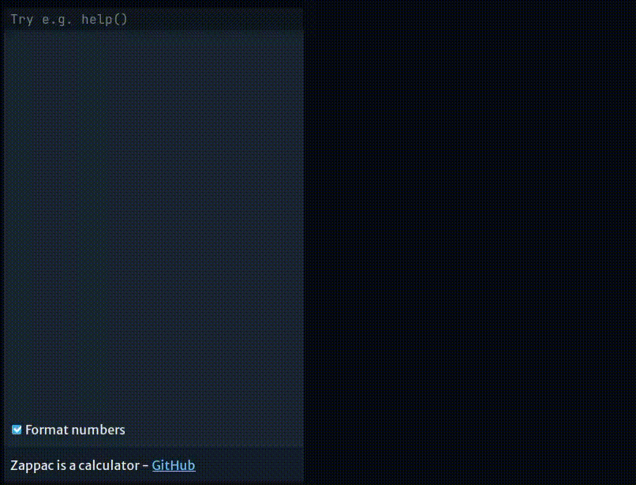

# README

Zappac is a calculator, for people who think like programmers.

```
1 + 2
$foo = 1 + 2
$bar = ($foo - 1) ** 16
1024 ^ $foo + $bar
```

More documentation probably coming at some point.



## Development

Built with [Wails](https://wails.io/) and [Svelte](https://svelte.dev). You will need the following
installed:

- [Wails](https://wails.io/docs/gettingstarted/installation)
- [Go 1.20+](https://go.dev/dl/)
- [Node 18+ (likely LTS)](https://nodejs.org/en)
- [Pnpm 8.6.0+](https://pnpm.io/installation)
- [go-pre-commit](https://github.com/lietu/go-pre-commit#using-the-hooks)
- [pre-commit](https://pre-commit.com/#install)

### Live Development

To run in live development mode, run `wails dev -loglevel Info` in the project directory. This will
run a Vite development server that will provide very fast hot reload of your frontend changes. If
you want to develop in a browser and have access to your Go methods, there is also a dev server that
runs on http://localhost:34115. Connect to this in your browser, and you can call your Go code from
devtools.

### Building

To build a redistributable, production mode package, use `wails build`.

### Dependencies

Update `zappaclang` with:

```shell
GONOPROXY=github.com/cocreators-ee go get -u
```

## License

The code is released under the BSD 3-clause license. Details in the [LICENSE](./LICENSE) -file.

# Financial support

This project has been made possible thanks to [Cocreators](https://cocreators.ee) and
[Lietu](https://lietu.net). You can help us continue our open source work by supporting us on
[Buy me a coffee](https://www.buymeacoffee.com/cocreators).

[](https://www.buymeacoffee.com/cocreators)
